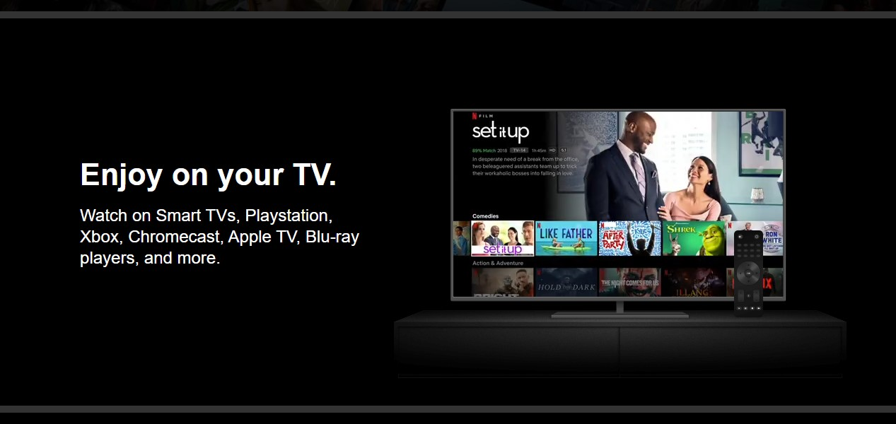

# Netflix-Clone

As part of learning to code,I completed a project that involved creating a basic Netflix clone built using HTML, CSS, and JavaScript. 

## Tech-Stack-

 

## Features-

- User-friendly interface: The project features a clean and intuitive user interface that makes it easy to navigate and search for content. The design is also responsive, adapting to different screen sizes and devices.

- Responsive design: The project is designed to be responsive, ensuring that the user interface is optimized for all screen sizes and devices. This includes desktops, laptops, tablets, and smartphones.

- Front-end development: The project showcases skills in front-end development, specifically using HTML, CSS, and JavaScript to create the user interface, implement interactivity, and fetch data from APIs.

- Project management: The project was developed using a version control system (Git) and follows best practices for code organization and documentation.

## Screenshot-

## Preview Video-
<video controls src="preview.mp4" title="Title"></video>